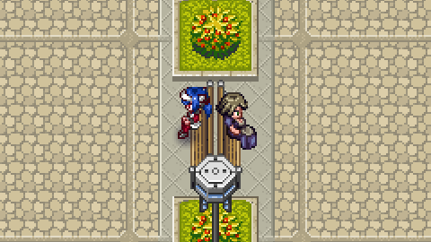

# CrossCode Sit Anywhere Mod

#### [Download the latest release](https://github.com/gen3vra/cc-sit-mod/releases/latest)

Use by default backslash (`\`) to sit. You can still move a bit while sitting to position yourself over an object. Use left bracket (`[`) or right bracket (`]`) to turn your head. Use the same key to return to the default position. Shift will slow you down for precise positioning.

If you have the 'input-api' mod, you will be able to rebind the keys in-game.